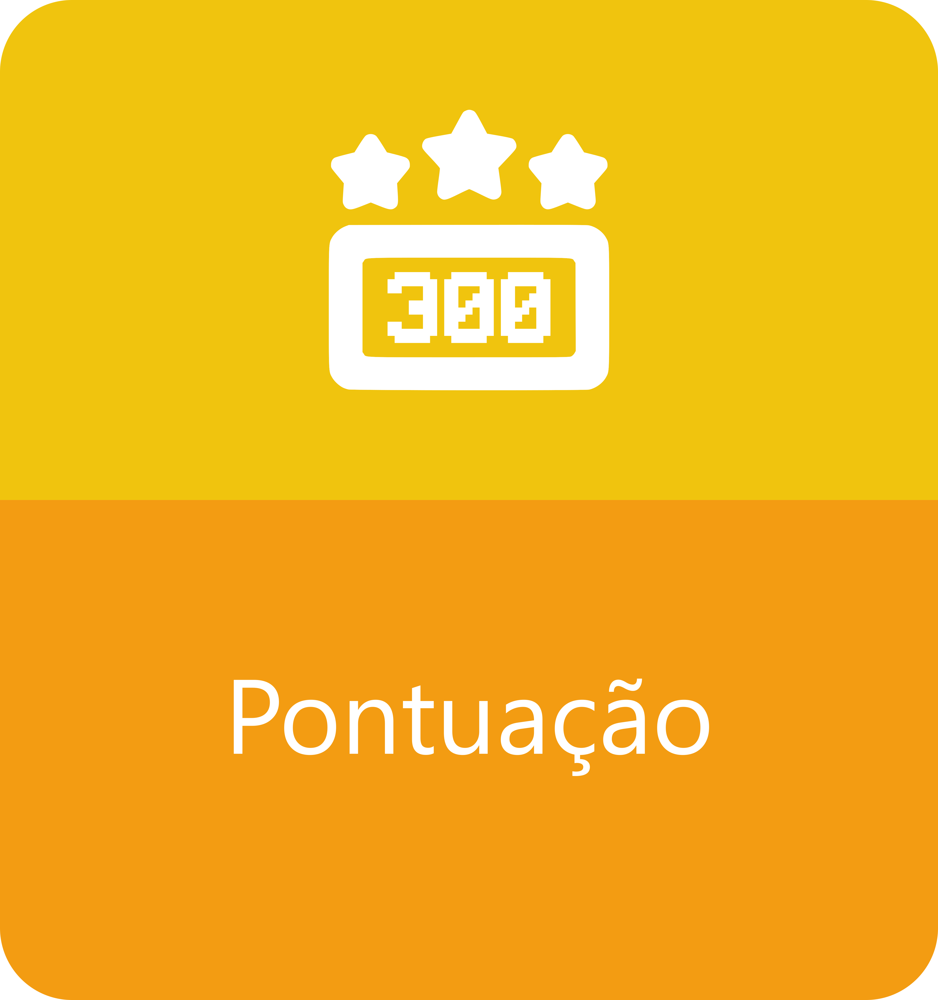

# GamIES: Um framework para Gamificação de Sala de Aula Invertida em Engenharia de Software

Bem-vindo ao GamIES! Este documento oferece uma visão geral e orientações sobre como aplicar nosso framework para integrar elementos de gamificação em suas aulas invertidas, potencializando a motivação e o engajamento dos alunos.

## Índice

- [Visão Geral](#visao-geral)
- [Principais Objetivos](#principais-objetivos)
- [Como Funciona](#como-funciona)
- [Estrutura](#estrutura)
- [Documentação](#documentacao)
- [Contribuições](#contribuicoes)
- [Licença](#licenca)

## Visão Geral

Este framework é desenvolvido para auxiliar professores de Engenharia de Software no planejamento e execução de suas aulas, assegurando um processo de ensino eficaz e engajador.
O framework **GamIES** foi desenvolvido para transformar a abordagem tradicional de ensino, facilitando a criação e a gestão de aulas invertidas de forma eficiente e integrada. Nossa solução oferece uma maneira simples e direta de preparar suas aulas, combinando teoria e prática com a motivação adicional dos elementos de gamificação.

## Principais Objetivos

- **Início Rápido e Eficiente**: Fornecer uma estrutura que permita aos professores criar e gerenciar aulas invertidas com agilidade, reduzindo o tempo necessário para preparar materiais e atividades.

- **Integração Fluida de Gamificação**: Incorporar elementos de gamificação, como pontuação, recompensas e desafios, para tornar o processo de aprendizado mais envolvente e motivador, incentivando a participação ativa dos alunos.

- **Avaliação Contínua e Abrangente**: Integrar mecanismos de avaliação, desde a avaliação diagnóstica até a pós-aula, para monitorar o progresso dos alunos, identificar lacunas no conhecimento e adaptar o ensino conforme necessário.

- **Foco na Aplicação Prática**: Facilitar a realização de atividades práticas que complementem o conteúdo teórico estudado, promovendo a aplicação prática do conhecimento e a resolução de problemas reais.

## Como Funciona

Este framework proporciona uma solução completa e flexível para o planejamento de aulas invertidas, combinando a eficiência na preparação de conteúdo com a motivação adicional dos elementos de gamificação. Com nossa abordagem, você pode criar experiências de aprendizado ricas e dinâmicas, com mínima configuração e máxima eficácia.

## Estrutura

A estrutura do framework é dividida em quatro partes: planejamento e preparação, ciclo de aprendizagem, sistema de gamificação e troca de pontos.

## Planejamento e Preparação
- Definição do conteúdo: O professor deve definir o tema que será ensinado para os alunos.  
- Definição do tópicos: Com o conteúdo a ser abordado definido, o professor deverá separar o contéudo em tópicos menores, para que o material a ser disponibilizado para estudos não fique extenso.
- Definição e Elaboração do material: 
- Definição do cronograma:
  - No cronograma deve ser descrito para cada tópico do conteúdo a data de liberação de cada material para alunos (de acordo com os artefatos produzidos, com base no ciclo de aprendizagem do framework GamIES), como também o prazo de entrega e a data do encontro com a turma.
  - Lembrando que para os roteiros de estudo o prazo de resposta precisa ser superior aos demais materiais, já que este precisa de mais tempo de dedicação do aluno para conclui-lo.
  - Uma boa prática é indicar no ínicio do roteiro quanto tempo em média o aluno precisará estudar para concluir o roteiro.
  - Abaixo algumas indicações sobre a disponibilidade dos materiais para os alunos:
    - Avaliação Diagnóstica, Roteiro de Estudos e Avaliação Pré-Aula: Devem ser disponibilizados juntos, é indicado liberar este material com pelo menos cinco dias antes do encontro com a turma (Atividade Prática).
    - Atividade Prática: Deve ser realizada na data definida no cronograma.
    - Avaliação Pós-Aula: Deve ser disponibilizado na mesma data da realização da Atividade Prática, após o encontro com a turma.

## Ciclo de Aprendizagem

O ciclo de aprendizagem do framework é baseado no processo de aprendizagem da metodologia de sala de aula invertida e é divido em cinco etapas: Avaliação Diagnostica, Roteiro do Estudos, Avaliação Pré-Aula, Atividade Prática e Avaliação Pós-Aula. Apenas a Atividade Prática é realizada na sala de aula, as demais etapas são realizadas pelo aluno fora da sala de aula. O ciclo se repete a cada novo tópico do conteúdo abordado. A quantidade de tópicos e o cronograma das atividades são definidas pelo professor na etapa de planejamento e preparação. A seguir são detalhadas todas estas etapas.

### Avaliação Diagnóstica

#### Descrição

Instrumento utilizado para avaliar o conhecimento prévio dos alunos em relação ao assunto que será abordado a fim de identificar quais conteúdos ele já domina e quais apresenta dificuldades.

#### Elementos de gamificação associados

    
    

#### Por que Fazer?

Isso permite identificar lacunas de aprendizado e ajustar o material de estudo de acordo com as necessidades individuais e coletivas dos estudantes. Além disso, também é uma oportunidade para que os estudantes se envolvam ativamente no processo de aprendizagem e reflitam sobre seus conhecimentos.

#### Como Fazer?

Geralmente, é realizada por meio de testes, questionários ou atividades que possibilitam ao professor ter um panorama sobre o nível de conhecimento do aluno.

Adoção de elementos de Gamificação, como pontuação e recompensas, para incentivar os estudantes a se empenharem mais no estudo, criando um ambiente divertido e desafiador. A competição saudável entre os estudantes também pode aumentar a motivação e o engajamento na aprendizagem.

Em uma abordagem de ensino adaptativa, em que o conteúdo do material de estudos pode ser personalizado, é possível fazer ajustes no material, focando nas áreas que precisam ser aprimoradas e explorando assuntos que o estudante não possui um nível de conhecimento elevado.

#### Exemplos

- Questionário com questões objetivas e com pontuações associadas às questões
- Questionário auto declarativo

### Roteiro de Estudos

#### Descrição

Serve como guia para os alunos, no momento de preparação para as atividades em sala. Materiais de estudos são disponibilizados pelo professor para que o aluno estude e aprenda o conteúdo em casa.

#### Elementos de gamificação associados

    
    
    

#### Por que Fazer?

Para que os alunos possam estudar o conteúdo abordado e se preparar para as aulas práticas na sala de aula. Esse momento é importante para que os alunos aprendam a parte teórica do conteúdo ministrado e consiga ter um bom desempenho nas atividades que serão realizadas com base no conteúdo estudado.

#### Como Fazer?

Esse roteiro pode incluir assistir aulas em vídeo, leitura de materiais, pesquisas, entre outras atividades, com o objetivo de facilitar a aprendizagem e direcionar o estudo dos estudantes.

Alguns elementos de gamificação podem ser incluídos no roteiro de estudos, como desafios e missões, com o objetivo de motivar e engajar os estudantes.

Outro elemento de gamificação que pode ser utilizado é o de progressão, incluindo componentes como uma barra de progresso ou sistema de níveis.

#### Exemplos

- Vídeo aulas
- Artigos científicos
- Capítulos de livros
- Sites

### Avaliação Pré-Aula

#### Descrição

Instrumento de avaliação que deve ser aplicado antes da aula prática, com o propósito de verificar o conhecimento adquirido pelos alunos sobre o tema abordado no roteiro de estudo disponibilizado pelo professor.

#### Elementos de gamificação associados

    
    
    

#### Por que Fazer?

O objetivo da avaliação pré-aula é identificar as lacunas do conhecimento do aluno e orientá-lo sobre quais tópicos precisam ser revistos ou reforçados durante o estudo. Além disso, essa avaliação também é importante para que o aluno formule dúvidas relacionadas ao assunto que podem ser direcionadas ao professor durante o momento em sala de aula.

#### Como Fazer?

Pode ser feita por meio de um questionário online, com questões de múltipla escolha, ou um exercício prático que estimule a reflexão sobre o assunto.

Uma opção de elemento de gamificação é o uso de uma barra de progresso ou pontuação que demonstre o desempenho do estudante enquanto ele responde às questões. À medida que o usuário acerta as perguntas, a barra de progresso aumenta ou a pontuação vai aumentando, demonstrando um feedback positivo. Por outro lado, quando uma resposta é incorreta, a barra de progresso pode diminuir ou a pontuação pode ser reduzida, oferecendo um feedback negativo e incentivando o usuário a melhorar seu desempenho.

Outro elemento de gamificação que pode ser adicionado são as conquistas ou medalhas. Ao acertar um certo número de perguntas, o usuário pode receber uma medalha ou conquista que será exibida em seu perfil ou em um placar. Essas medalhas funcionam como recompensas virtuais e motivam o usuário a continuar respondendo às questões.

Utilizar elementos visuais para fornecer um feedback imediato. Quando o usuário acertar uma questão, a resposta correta pode ser marcada em verde e o usuário pode visualizar uma animação positiva. Em contrapartida, ao errar, a resposta correta pode ser marcada em vermelho e o usuário pode ver uma animação indicando que a resposta está incorreta.

#### Exemplos

- Questionário com questões de múltipla escolha
- Feedback indicando uma resposta incorreta e uma resposta correta
- Elemento que mostre o desempenho e progresso do usuário
- Recompensas para incentivar o usuário

### Aulas Práticas

#### Descrição

Atividades práticas realizadas na sala de aula ou no encontro da turma com o professor. Essas atividades podem envolver a resolução de problemas, simulações, jogos educacionais, quizzes, entre outras atividades relacionadas ao assunto abordado nos materiais disponibilizados anteriormente.

#### Elementos de gamificação associados

    
    
    
    
    

#### Por que Fazer?

Para que os alunos possam exercitar o conhecimento adquirido durante os estudos em casa. Durante este momento, o professor também pode responder às dúvidas dos alunos e avaliar o nível de compreensão da turma e ajustar suas explicações de acordo com as necessidades dos alunos.

#### Como Fazer?

O professor(a) deve marcar um encontro com a turma a ser realizado após a conclusão das etapas anteriores. No primeiro momento, o professor pode aproveitar para sanar dúvidas dos alunos com relação ao conteúdo abordado. Em seguida, deve ser realizada uma atividade prática em grupo sobre o assunto abordado. A atividade fica a critério do professor, e esta deve ser planejada antes do encontro com a turma.

Para promover a participação e melhor interação entre os alunos, alguns elementos de gamificação podem ser incluídos na atividade, como:

- **Pontuação**: Pontuar as atividades realizadas pelos alunos, criando um ranking ou tabela de classificação.
- **Recompensas**: Oferecer recompensas aos alunos que alcançarem determinados objetivos ou atingirem um número específico de pontos.
- **Desafios**: Propor desafios aos alunos, incentivando-os a resolver problemas utilizando o conhecimento adquirido.
- **Competições**: Promover competições em sala de aula, como quizzes ou jogos, estimulando a participação e a colaboração entre os alunos.
- **Premiações**: Premiar os alunos com melhores desempenhos ou que mais se destacarem durante as atividades gamificadas.

#### Exemplos

- Fornecer materiais das atividades que já realizamos
- Demonstrar o uso dos elementos de gamificação na prática

### Avaliação Pós-Aula

#### Descrição

Instrumento de avaliação que deve ser aplicado após a realização da aula prática, com o intuito de verificar o grau de compreensão e assimilação dos conteúdos pelos estudantes.

    
    
    

#### Por que Fazer?

A avaliação pós-aula permite ao professor identificar se os objetivos de aprendizagem foram alcançados e se é necessário reforçar algum conteúdo. Também oferece aos alunos a oportunidade de revisar o conteúdo aprendido.

#### Como Fazer?

Pode ser feita por meio de testes, provas, trabalhos individuais ou em grupo, apresentações orais, entre outros.

#### Exemplos

- Questionário com questões de múltipla escolha
- Recompensa associada ao desempenho com relação a nota obtida ao responder o questionário

### Sistema de gamificação

### Troca de pontos

## Ferramentas de apoio

- **Classcraft**
  - Classcraft é uma plataforma de gamificação voltada para o ambiente educacional. Ela transforma a sala de aula em um jogo de RPG (Role-Playing Game), onde os alunos podem criar avatares, ganhar pontos de experiência, completar missões e trabalhar em equipes. O objetivo é aumentar o engajamento dos alunos, promover a colaboração e melhorar o comportamento. Com esta ferramenta é possível fornecer um ambiente gamificado, onde o aluno percorre as fases por meio dos roteiros de estudos e avaliações. As pontuações podem ser destinadas de forma automática.

- **Google Forms**
O Google Forms é uma ferramenta gratuita do Google que permite criar formulários, questionários e pesquisas online. Ele é amplamente utilizado para coletar dados de forma simples e eficiente. As respostas são automaticamente registradas em uma planilha do Google Sheets, facilitando a análise dos dados. A ferramenta é útil para criar avaliações, pesquisas de feedback, inscrições e muito mais. Com esta ferramenta é possível elaborar os questionários online para as avaliações e roteiros de estudos.

- **Google Data Studio**
O Google Data Studio é uma ferramenta de visualização de dados que permite criar relatórios e dashboards interativos a partir de diversas fontes de dados, como Google Sheets, Google Analytics, e muitas outras. É ideal para transformar dados brutos em insights visuais, facilitando a tomada de decisões. Com ele, é possível personalizar gráficos, tabelas e outros elementos visuais para criar relatórios dinâmicos que podem ser compartilhados com facilidade. Com esta ferramenta é possivel fornecer um feedback aos alunos sobre as suas pontuações e processo na experiência gamificada.

## Contribuições

Se você deseja contribuir para o desenvolvimento deste framework, por favor, leia nosso [Guia de Contribuições](CONTRIBUTING.md).

## Licença

Este projeto está licenciado sob a [Licença MIT](LICENSE).

